# Working with the CC3200

This is a small tutorial on working with the CC3200 LaunchPad from Texas Instruments.

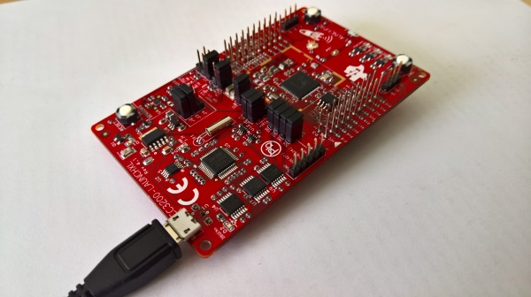

## Overview

In this sample we will work with the CC3200 LaunchPad. Initially, our target will be to get some LEDs blinking. Then we will use one of the available sensors to control the blinking frequency. Finally, we will get the blinking frequency from some service accessible via HTTP.

## Requirements

In order to fully cover this tutorial we need the following setup:

* The TI CC3200-LaunchXL board
* One USB micro cable
* Computer with Windows, Linux, or macOS and an USB port
* Installed [Energia IDE](http://energia.nu/download/)
* Internet access via WiFi

We can use the editor provided by Energia or any other editor, e.g., Sublime Text, Emacs, or vim.

## Step-By-Step

We start by running the Energia IDE. In case the Energia IDE has not been run (with the CC3200) previously we need to set everything up first.

### Energia: First-Time Setup

Depending on the OS different instructions need to be followed.

**Windows**

The CC3200 should not be connected, otherwise we should remove it first. The following instructions are useful to setup the drivers for Energia.

1. Download the CC3200 Drivers for Windows from [here](http://energia.nu/files/cc3200_drivers_win.zip).
2. Unzip and run *DPinst.exe* for the 32-bit version or *DPinst64.exe* for 64-bit version of Windows.
3. Follow the installer instructions.
4. Connect the CC3200 LaunchPad. The CC3200 should be automatically recognized by Energia.

For Windows 8 or later we may need to disable the signed driver feature, [see this guide](https://learn.sparkfun.com/tutorials/disabling-driver-signature-on-windows-8).

**Linux**

On recent versions of Linux the FTDI kernel driver that is needed for the CC3200 LaunchPad is already installed. The only thing we need to do is to tell Linux to use that driver when we plug in the CC3200 LaunchPad.

**macOS**

The CC3200 should not be connected, otherwise we should remove it first. The following instructions are useful to setup the drivers for Energia.

1. Download the CC3200 Drivers for macOS from [here](http://energia.nu/files/EnergiaFTDIDrivers2.3.zip).
2. Unzip and run *EnergiaFTDIDrivers2.2.18.pkg*.
3. Follow the installer instructions.
4. Reboot the system.
5. Connect the CC3200 LaunchPad. The CC3200 should be automatically recognized by Energia.

### Energia Basics

The Energia IDE looks as presented in the next image.

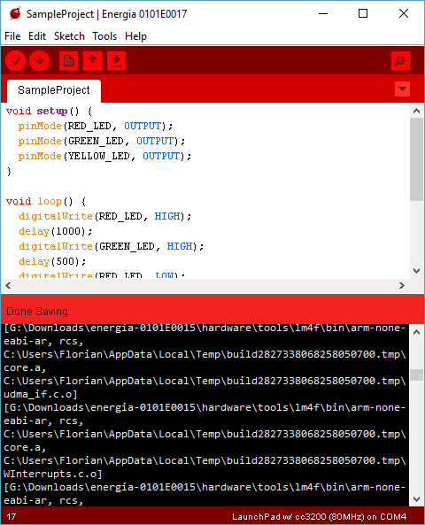

It contains a code area with a mediocre text editor. The output is shown in the black box on the bottom. The most important file is an Energia project (*x.ino*), which is always contained in a folder with the name of the file (by convention). These files are called *sketches*. Every sketch file contains two C-like functions, `setup` and `loop`. Instead of writing everything from scratch ourselves, we typically only fill in the bodies of those two functions. Energia already knows everything about the board and how to talk to it.

The board specific header file and the definitions for `setup` and `loop` have been made already. These two functions will be called from implicitly generated code and are therefore special. `setup` is run once during the initialization, and `loop` is repeatedly called after the initialization. The latter never finishes, as it is invoked over and over again (hence the name `loop`).

For debugging purposes the serial monitor will be crucial. We'll come back to the monitor in a second.

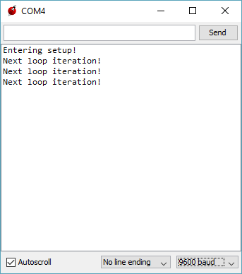

While you can do everything from the built in editor, you'll probably quickly get annoyed by it. In *File* / *Preferences* we'll find the option to tell Energia that we are using an external editor. You can then simply edit and save the *x.ino* file in your favorite editor. The compilation and flashing the code to the board is still done in the Energia window.

### The Code

The [reference](http://energia.nu/Reference_Index.html) section of the Energia homepage will be your best friend when programming the CC3200 LaunchPad, especially in figuring out the inbuilt IO functions. Make sure to also check out the example sketches in *File* / *Examples*.

The board comes with three LEDs that can be used for simple showcases, testing and prototyping. (Remember that whenever we can blink an LED we can basically control anything.)

* `RED_LED` (29)
* `GREEN_LED` (10)
* `YELLOW_LED` (9)

All the hardware addresses and definitions can be found in *hardware/cc3200/variants/launchpad/pins_energia.h*. Initially, our code may be as simple as follows:

```C
void setup() {
  Serial.begin(9600);
  Serial.println("Entering setup!");
}

void loop() {
  Serial.println("Next loop iteration!");
  delay(5000);
}
```

This code instructs the LaunchPad to initialize the serial port for sending messages (at 9600 baud). Afterwards, we are printing "Entering setup!" once and "Next loop iteration!" every five seconds. The `delay` function puts the device to sleep for the specified amount of milliseconds. Of course there is no monitor connected to the CC3200 LaunchPad. Instead `Serial.println` transmits the string via USB to your computer, where it is displayed in the serial monitor.

The previously mentioned three LEDs may now be used as follows (instead of their numeric values we fall back to the named macros - it's just much easier to read):

```C
void setup() {
  Serial.begin(9600);
  Serial.println("Entering setup!");
  pinMode(RED_LED, OUTPUT);
  pinMode(GREEN_LED, OUTPUT);
  pinMode(YELLOW_LED, OUTPUT);
}

void loop() {
  Serial.println("Next loop iteration!");
  digitalWrite(RED_LED, HIGH);
  delay(1000);
  digitalWrite(GREEN_LED, HIGH);
  delay(500);
  digitalWrite(RED_LED, LOW);
  digitalWrite(YELLOW_LED, HIGH);
  delay(1000);
  digitalWrite(GREEN_LED, LOW);
  delay(1000);
  digitalWrite(YELLOW_LED, LOW);
  delay(500);
}
```

Most pins of the CC3200 are multiplexed, i.e. they can serve different purposes. Most of them can either be used for input or output. Therefore, we have to configure the pins which are connected to the LEDs in the beginning. For all of them we use the `OUTPUT` setting (resolving to 1, whereas `INPUT` would resolve to 0). The `digitalWrite` function is then used to write a value to a given address, e.g., 1 (named `HIGH`) to the address of the `RED_LED` or 0 (named `LOW`) to the address of the `GREEN_LED`.

What happens here is that we get the following sequence:

* RED (1s)
* RED/GREEN (0.5s)
* GREEN/YELLOW (1s)
* YELLOW (1s)
* (dark) (0.5s)

Now it's time to connect the LaunchPad and upload our program!

### Connecting the LaunchPad

The easiest way to get it on the LaunchPad is to press `CTRL + M` in Energia. This will compile the binaries, upload the code, open the serial monitor, and run the application. However, by design the LaunchPad does not offer a very programmer friendly method for a quick build - test - debug loop. It is required to set different jumpers to go from run-mode to program-mode and back again.

The following image shows a neat workaround using the J8 (TOP) connector together with the SOP2 (BOTTOM).

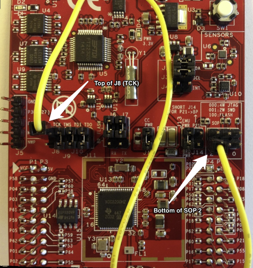

Here are the detailed step-by-step instructions:

1. We start by removing both jumpers J8 and SOP2 (if installed).
2. With the USB connector facing up, we connect one side of the jumper wire to the top of J8 and the other side to the bottom of SOP2.

Now when we run the code from Energia via `CTRL + M` we will see the serial monitor popping up (be sure to have the correct baud rate configured!) and the LEDs start blinking.

At this point in time our setup looks similar to the next image.

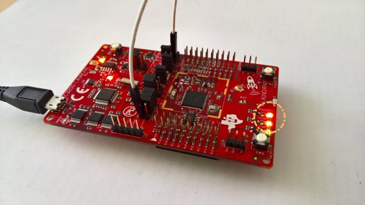

So far so good. The next step is to get a little bit more interactive. We could either use one of the buttons,

* `PUSH1` (3)
* `PUSH2` (11)

or some information from an integrated sensor. For the buttons we would use `digitalRead` (see [reference](http://energia.nu/Reference_Index.html)) to get the state (`HIGH` or `LOW`) and constantly monitor the current state via polling. Buttons are boring so let's go for the sensor input right away.

### Using the Accelerometer

The board comes with some sensors. There is the temperature sensor (called `tmp006`), which is available at the address 0x41, and an accelerometer (`bma222`) at 0x18. In this sample we will use the accelerometer as it is far easier to use for demo purposes (the latency and accuracy for manipulating temperatures are quite difficult to manage).

**Warning** As there is an overlap in the address register we can't use the yellow and green LED together with the accelerometer (remember that almost all pins are multiplexed). Consequently, we will only use the red LED from now on.

To read out the accelerometer sensor we include the header *Wire.h*. Also we should put the code we write to read from the accelerometer in a new file. We will call it *accelerometer.cpp* with the header *accelerometer.h*. Initially, our code looks as follows:

```C
#include <Wire.h>
#include "accelerometer.h"

void setup() {
  Serial.begin(9600);
  Serial.println("Entering setup!");
  Wire.begin();
  pinMode(RED_LED, OUTPUT);
}

void loop() {
  Serial.println("Next loop iteration!");
  AccData acc = readAccelerometer();
  Serial.print(acc.x);
  Serial.print(", ");
  Serial.print(acc.y);
  Serial.print(", ");
  Serial.println(acc.z);
  digitalWrite(RED_LED, HIGH);
  delay(1000);
}
```

The `readAccelerometer` function is declared in our new header file. In the `setup` function we need to initialize the Wire library. In each iteration we read the accelerometer and print the values to the screen. Running this in Energia results in the following output.

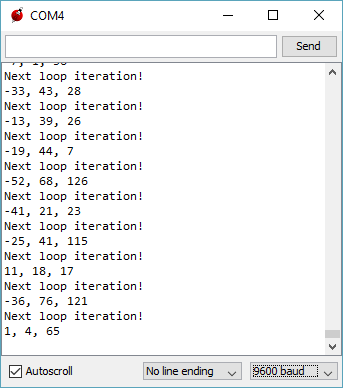

The `AccData` structure is defined in our header. The code here looks as follows.

```C
#pragma once
#include <stdint.h>

struct AccData {
  int8_t x;
  int8_t y;
  int8_t z;
};

AccData readAccelerometer();
```

Quite straightforward. The source file is much more interesting.

```C
#include "accelerometer.h"

// ...

int8_t readSingleAxis(uint8_t axis);

AccData readAccelerometer() {
  AccData data;
  data.x = readSingleAxis(0x03);
  data.y = readSingleAxis(0x05);
  data.z = readSingleAxis(0x07);
  return data;
}
```

We read the registers for each of the components of the three dimensional acceleration vector and return the full result. The question is now how the `readSingleAxis` for reading a single component is defined. The rest is displayed below.

```C
#include <Energia.h>
#include <Wire.h>

void initializeI2C(uint8_t base_address, uint8_t register_address) {
  Wire.beginTransmission(base_address);
  Wire.write(register_address);
  Wire.endTransmission();
}

uint8_t readI2C(uint8_t base_address, uint8_t register_address) {
  initializeI2C(base_address, register_address);
  Wire.requestFrom(base_address, OUTPUT);

  while (Wire.available() < HIGH);

  return Wire.read();
}

int8_t readSingleAxis(uint8_t axis) {
  return readI2C(0x18, axis);
}
```

Each read operation starts an I2C transmission at the given address. We remember that the address for the accelerometer was 0x18. The access is given by the register specified in the call. The whole flow is only representing the expected I2C timing diagram.

Having written this part we can adjust the code in the `loop` function to show the red light in case of a "falling" board. From our elementary physics course in school we remember that a falling body is essentially free, i.e., the acceleration in `z` direction will be zero (as compared to `1` in units of *g* for a body standing on the earth's surface).

As we measure a value of approx. `65` in z-direction by default we may normalize to this value. We should show a red light for values below 0.4 *g*. Our modified code looks as given below.

```C
#include <Wire.h>
#include "accelerometer.h"

void setup() {
  Serial.begin(9600);
  Wire.begin();
  pinMode(RED_LED, OUTPUT);
}

void loop() {
  AccData acc = readAccelerometer();
  Serial.println(acc.z);

  if (acc.z > 26) {
    digitalWrite(RED_LED, LOW);
  } else {
    digitalWrite(RED_LED, HIGH);  
  }
}
``` 

Potentially, we want to the warning to stay active for at least some time - in this case we may modify the code to look as follows.

```C
if (acc.z > 26) {
  digitalWrite(RED_LED, LOW);
} else {
  digitalWrite(RED_LED, HIGH);  
  delay(1000);
}
```

This will activate the LED for at least 1 second.

### HTTP Requests

Until this point we already archieved quite a lot. We started with a simple kind of "Hello World" and reached a stage where we are able to gather sensor information and trigger outputs based on the collected information. Now we want to go one step further.

We can use [random.org](https://random.org) to make a request to its API, e.g., [to get a single integer](https://www.random.org/integers/?num=1&min=1&max=100&col=1&base=10&format=plain&rnd=new). The resulting number will then be displayed using a blinking LED. A five-second pause (LED off) is inserted after each HTTP call.

Before we can start with an HTTP call we need to establish a network connection. Luckily, the CC3200 LaunchPad comes with a WiFi chip on-board.

Similar to the integration of the accelerometer we put the code in a new file *wifi.cpp*. The header is quite simple. Here we only declare a single function.

```C
#pragma once

void connectWifi(char* ssid, char* password);
```

The source file contains quite some debug printing, which is useful to identify what's going on in the setup process. To make it fully work we use the WiFi library that comes with Energia.

```C
#include "wifi.h"
#include <Energia.h>
#include <WiFi.h>

void connectWifi(char* ssid, char* password) {	
  Serial.print("Connecting to WIFI network ");
  Serial.print(ssid);
  WiFi.begin(ssid, password);
  
  while (WiFi.status() != WL_CONNECTED) {
    Serial.print(".");
    delay(300);
  }
  
  Serial.println(" connected!");
  Serial.print("Waiting for an IP address ");
  
  while (WiFi.localIP() == INADDR_NONE) {
    Serial.print(".");
    delay(300);
  }
  
  Serial.println(" received!");
}
```

The steps included here are simple. We start by connecting to the WiFi network. We then wait until the connection is established. Finally, we also wait until the router assigned us some IP. At this point in time the WiFi connection is established and ready to be used.

How to we now make an HTTP request? Well, it turns out that this is not such an easy task! We'll start with a request to [httpbin.org](http://httpbin.org/) before we deal with [random.org](https://random.org).

In the beginning our API is as simple as the following declaration:

```C
bool httpGetRequest(char* hostname, char* path);
```

We just pass in a hostname, e.g., *httpbin.org*, and a path. In our case we choose `/bytes/4` to obtain 4 random bytes. The source code for the handling function looks close to the code shown below.

```C
#include <Energia.h>
#include <WiFi.h>

bool httpGetRequest(char* host, char* path) {
  String hostname = String(host);
  String head_post = "GET " + String(path) + " HTTP/1.1";
  String head_host = "Host: " + hostname;
  String request = head_post + "\n" + 
                   head_host + "\n\n";

  char receive_msg_buffer[1024];
  uint32_t host_ip;
  bool success = false;

  SlTimeval_t timeout { .tv_sec = 45, .tv_usec = 0 };
  
  if (sl_NetAppDnsGetHostByName((signed char*)hostname.c_str(), hostname.length(), &host_ip, SL_AF_INET)) {
    return false;
  }

  SlSockAddrIn_t socket_address {
    .sin_family = SL_AF_INET, .sin_port = sl_Htons(80), .sin_addr = { .s_addr = sl_Htonl(host_ip) }
  };

  uint16_t socket_handle = sl_Socket(SL_AF_INET, SL_SOCK_STREAM, IPPROTO_TCP);

  if (sl_SetSockOpt(socket_handle, SL_SOL_SOCKET, SL_SO_RCVTIMEO, (const void*)&timeout, sizeof(timeout)) >= 0 &&
      sl_Connect(socket_handle, (SlSockAddr_t*)&socket_address, sizeof(SlSockAddrIn_t)) >= 0 &&
      sl_Send(socket_handle, request.c_str(), request.length(), 0) >= 0 &&
      sl_Recv(socket_handle, receive_msg_buffer, sizeof(receive_msg_buffer), 0) >= 0) {
    Serial.println(receive_msg_buffer);
    success = true;  
  }

  sl_Close(socket_handle);
  return success;
}
```

First we define the request message to send. Note that the double newline at the end is crucial; it is indicating that the header ends here. Otherwise we'll receive a timeout as the server waits for more. Then we retrieve the IP address of the host to connect to. Then we set up the connection socket as TCP/IP on port 80 (standard HTTP connection). The steps to follow are then described as

* setting socket options; in this case we only set the timeout to 45s,
* connecting to the socket using the previously defined options
* sending the content: we transmit the request, which is given by the headers only, and finally
* receiving the answer.

The response will be available as a single string - there is no distinction between headers and content body by default. We need to do the parsing.

Once we deploy the code we should see something similar to the following:

```plain
HTTP/1.1 200 OK
Server: nginx
Date: Sat, 18 Jun 2016 07:24:31 GMT
Content-Type: application/octet-stream
Content-Length: 4
Connection: keep-alive
Access-Control-Allow-Origin: *
Access-Control-Allow-Credentials: true

L=r
```

If we did not receive anything, we should do some debugging to find the origin of the problem. The last characters are the string representation of the 4 random bytes we are interested in.

### Debugging the LaunchPad

Debugging software on embedded systems is difficult. Most of the tooling and techniques we've learned to love are not available. Essentially, we are back to the stone age of programming. We've already seen that the `Serial` class represents a useful utility to gain some knowledge about what's actually going on.

The CC3200 LaunchPad has a JTAG (4 wire) and SWD (2 wire) interface for development and debugging. In this tutorial we will not go to the hardware level. Instead, we'll use the serial interface provided by the FTDI connector via USB. We've already seen that writing messages to the serial interface is an option, however, an even better option is to install the Code Composer Studio from Texas Instruments and use breakpoints. This brings back one of the most useful and efficient debugging methods available in standard programming.

Once we've downloaded and installed the [Code Composer Studio](http://www.ti.com/ccs) we can set it up to connect to the right COM port with the configured bandwidth. It is important to configure CCS to point to the Energia installation path. Otherwise, required libraries and files may not be found. Finally, we may open Energia projects directly from CCS.

Another cool option of CCS is the ability to view the currently used registers and memory directly. This is shown below.

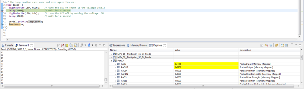

This way we can accelerate the search for possible errors in our code. Assuming that the HTTP request now runs smoothly we can come back to solve our original problem: Making a secure HTTP request from the CC3200.

### HTTPS with the TPM

Right now we've only managed to make a non-secure, i.e., standard, HTTP request. For making a secure HTTP request we also need the SSL/TLS layer on top of TCP/IP. This requires a certificate to be used. Normally, the browser would automatically get the certificate, validate it, and confirm the ownership with the helper of an external certificate authority (first asking the hosting OS, then a list of web authorities). In case of the CC3200 there is no browser with tons of included features. We need to provide the certificate ourselves!

In the browser of our choice we can go to random.org, click on the certificate icon in the beginning of the location field, and get the details.

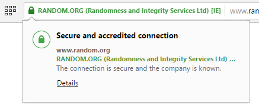

Clicking on the certificate name will open a dialog from the OS. Under Windows the dialog looks as follows. We will have to open the third tab here. In this tab we need to select the root certificate (top of the tree) and view the details.

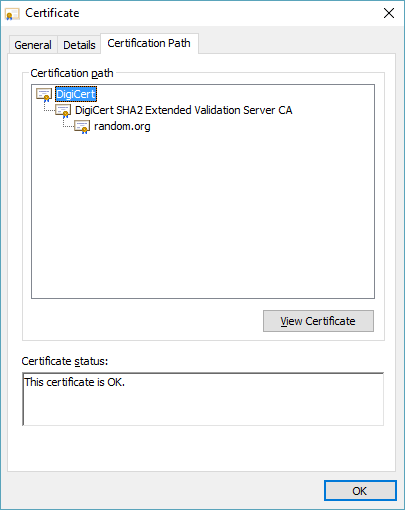

The certificate itself can then be extracted via the certificate details.

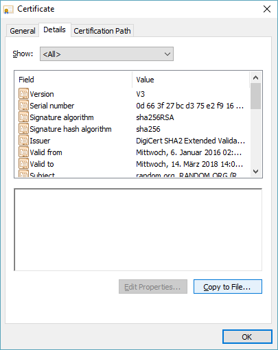

We now need to perform the "Copy to file" action. Export the certificate as a *.cer*-file using the DER encoding. The certificate now needs to be stored on the CC3200. The following instructions should help us get going:

1. Download and start [UniFlash](http://www.ti.com/tool/uniflash) for the CC3200.
2. In Uniflash, click the "add file" operation.
3. Name the file to `/cert/random.pem`.
4. In the url field we select the location where we stored the root certificate.
5. We now check the erase and update options.
6. Finally, we select perform the program operation.

Once we started UniFlash we need to create a new configuration. The following screenshot shows the configuration to choose for the CC3200.

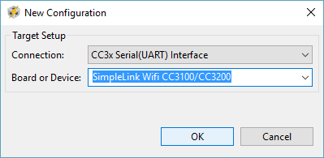

The UniFlash application can only program the CC3200 when no other application is accessing the same COM port. Hence we need to disable the Serial Monitor from Energia. Otherwise, we will get a failure message.

The device needs to be in program mode (J8 and SOP2 disconnected) and resetted once told to be programmed.

For making secure GET requests we use the following function declaration.

```C
bool httpSecureGetRequest(char* hostname, char* path, char* certificate);
```

The function itself is quite similar to the other one. The changes are all related to introduce the mandatory security layer on top.

```C
#include <Energia.h>
#include <WiFi.h>

bool httpSecureGetRequest(char* host, char* path, char* cert) {
  String hostname = String(host);
  String certificate = String(cert);
  String head_post = "GET " + String(path) + " HTTP/1.1";
  String head_host = "Host: " + hostname;
  String request = head_post + "\n" + 
                   head_host + "\n\n";

  char receive_msg_buffer[1024];
  uint32_t host_ip;
  bool success = false;

  SlSockSecureMask cipher { SL_SEC_MASK_TLS_ECDHE_RSA_WITH_AES_256_CBC_SHA };
  SlSockSecureMethod method { SL_SO_SEC_METHOD_SSLv3_TLSV1_2 };
  SlTimeval_t timeout { .tv_sec = 45, .tv_usec = 0 };
  
  if (sl_NetAppDnsGetHostByName((signed char*)hostname.c_str(), hostname.length(), &host_ip, SL_AF_INET)) {
    return false;
  }

  SlSockAddrIn_t socket_address {
    .sin_family = SL_AF_INET, .sin_port = sl_Htons(443), .sin_addr = { .s_addr = sl_Htonl(host_ip) }
  };

  uint16_t socket_handle = sl_Socket(SL_AF_INET, SL_SOCK_STREAM, SL_SEC_SOCKET);

  if (sl_SetSockOpt(socket_handle, SL_SOL_SOCKET, SL_SO_SECMETHOD, (const void*)&method, sizeof(method)) >= 0 &&
      sl_SetSockOpt(socket_handle, SL_SOL_SOCKET, SL_SO_SECURE_MASK, (const void*)&cipher, sizeof(cipher)) >= 0 &&
      sl_SetSockOpt(socket_handle, SL_SOL_SOCKET, SL_SO_SECURE_FILES_CA_FILE_NAME, (const void*)certificate.c_str(), certificate.length()) >= 0 &&
      sl_SetSockOpt(socket_handle, SL_SOL_SOCKET, SL_SO_RCVTIMEO, (const void*)&timeout, sizeof(timeout)) >= 0 &&
      sl_Connect(socket_handle, (SlSockAddr_t*)&socket_address, sizeof(SlSockAddrIn_t)) >= 0 &&
      sl_Send(socket_handle, request.c_str(), request.length(), 0) >= 0 &&
      sl_Recv(socket_handle, receive_msg_buffer, sizeof(receive_msg_buffer), 0) >= 0) {
    Serial.println(receive_msg_buffer);
    success = true;  
  }

  sl_Close(socket_handle);
  return success;
}
```

So what changed? For the connection we use the `SL_SEC_SOCKET` constant instead of a raw TCP socket. This requires us to set the secure mode via the options. Finally encryption options and the certificate need to be passed in. Note that we also use a different port (`443` instead of `80`). The selection of the right method is quite important.

The following methods exists:

* `SL_SO_SEC_METHOD_SSLV3` for SSL 3
* `SL_SO_SEC_METHOD_TLSV1` for TLS 1.0
* `SL_SO_SEC_METHOD_TLSV1_1` for TLS 1.1
* `SL_SO_SEC_METHOD_TLSV1_2` for TLS 1.2
* `SL_SO_SEC_METHOD_SSLv3_TLSV1_2` for SSL 3 / TLS 1.2
* `SL_SO_SEC_METHOD_DLSV1` for DTL 1.0

The right encryption mode need sto be selected as well. Here the following options exist:

* `SL_SEC_MASK_SECURE_DEFAULT`
* `SL_SEC_MASK_SSL_RSA_WITH_RC4_128_SHA`
* `SL_SEC_MASK_SSL_RSA_WITH_RC4_128_MD5`
* `SL_SEC_MASK_TLS_RSA_WITH_AES_256_CBC_SHA`
* `SL_SEC_MASK_TLS_DHE_RSA_WITH_AES_256_CBC_SHA`
* `SL_SEC_MASK_TLS_ECDHE_RSA_WITH_AES_256_CBC_SHA`
* `SL_SEC_MASK_TLS_ECDHE_RSA_WITH_RC4_128_SHA`

The right mask needs to be selected after inspection of the certificate.

Upon execution we may face the error code **-155**. This means that the certificate is wrong. We should use the root certificate (see above) and not one of the derived ones.

Nevertheless, at this point we may face another error code: **-461**. This is the *data verification error*. The error sounds more problematic as it is. The certificate needs to validated on the CC3200. This process includes checking the expiration time. Since we did not set the current date/time the verification fails. We can change it as simple as placing the following snippet in the `setup` function:

```C
SlDateTime_t current_time = getCurrentTime();
sl_DevSet(SL_DEVICE_GENERAL_CONFIGURATION, SL_DEVICE_GENERAL_CONFIGURATION_DATE_TIME, sizeof(current_time), (uint8_t*)(&current_time));
```

where `getCurrentTime` could be be defined as follows:

```C
SlDateTime_t getCurrentTime() {
  return CSlDateTime_t {
    .sl_tm_sec = 30,
    .sl_tm_min = 25,
    .sl_tm_hour = 17,
    .sl_tm_day = 18,
    .sl_tm_mon = 6,
    .sl_tm_year = 2016,
    .sl_tm_week_day = 6,
    .sl_tm_year_day = 170,
  };
}
```

Of course, this is not really the current time; it is a constant that will is invalid once published. As a first solution this is alright, but a better one uses the time server via UDP.

### Getting the Current Time

The basic interface for getting the time is quite simple. The header looks as follows.

```C
#pragma once
#include <WiFi.h>

SlDateTime_t getCurrentTime();

void setCurrentTime();
```

The `setCurrentTime` is merely doing what we discussed previously: calling `getCurrentTime` and setting the time on the device. So let's dive into the implementation of `getCurrentTime` right away!

```C
long long total_secs = getUnixTime() - LEAPOCH;

// Break the total seconds into years, months, days, ...

return SlDateTime_t {
  .sl_tm_sec = remaining_secs % 60,
  .sl_tm_min = remaining_secs / 60 % 60,
  .sl_tm_hour = remaining_secs / 3600,
  .sl_tm_day = remaining_days + 1,
  .sl_tm_mon = remaining_months + 1,
  .sl_tm_year = remaining_years + 2000,
  .sl_tm_week_day = day_of_week,
  .sl_tm_year_day = day_of_year,
};
```

`getUnixTime` is defined to get the official time from an NTP server (starting at 1900) and subtract the 70 years years to normalize the value to the Unix timestamp. The official time is received via UDP as given below.

```C
uint32_t getOfficialTime() {
  WiFiUDP udp;
  IPAddress time_server(129, 6, 15, 29);
  byte packet_buffer[NTP_PKG_SIZE];
  uint32_t secs_since_1900 = 0;
  int retries = 100;
  udp.begin(UDP_DST_PORT);
  memset(packet_buffer, 0, NTP_PKG_SIZE);

  // Initialize values needed to form NTP request
  packet_buffer[0] = 0b11100011;   // LI, Version, Mode
  packet_buffer[1] = 0;            // Stratum, or type of clock
  packet_buffer[2] = 6;            // Polling Interval
  packet_buffer[3] = 0xEC;         // Peer Clock Precision

  // 8 bytes of zero for Root Delay & Root Dispersion
  packet_buffer[12] = 49;
  packet_buffer[13] = 0x4E;
  packet_buffer[14] = 49;
  packet_buffer[15] = 52;

  udp.beginPacket(time_server, NTP_PORT);
  udp.write(packet_buffer, NTP_PKG_SIZE);
  udp.endPacket();

  while (!udp.parsePacket() && retries > 0) {
    delay(100);
    retries--;
  }

  udp.read(packet_buffer, NTP_PKG_SIZE);
  uint32_t high_word = word(packet_buffer[40], packet_buffer[41]);
  uint32_t low_word = word(packet_buffer[42], packet_buffer[43]);
  secs_since_1900 = high_word << 16 | low_word;

  udp.stop();
  Serial.println(secs_since_1900);
  return secs_since_1900;
}
```

The IP address of the *time.nist.gov* server has been retrieved via the command line.

```plain
$ ping time.nist.gov

Pinging ntp1.glb.nist.gov [129.6.15.29] with 32 bytes of data:
```

The rest may seem cryptic (and some lines certainly are!), but the main idea is:

1. Start a UDP server.
2. Connect to the NTP server.
3. Send the bytes to the server.
4. Wait for a response (max. 10 seconds).
5. Read the response (will be zero if we exceeded the waiting time).
6. Retrieve the evaluated response.

That's it! Finally, we have some convenience by setting the right time in the beginning. The only thing that's still missing for our tutorial is to read out the random number and show the number by blinking.

### Reading the Content

To read the content we only need to supply another argument to our HTTP functions: the response. Right now, we use an internal buffer to capture the response. Once we change this to support an out-parameter we are good. With the response in our hands we can now supply a function to parse the message for the random number.

The following code extracts the number from the response. We will first get it, skip the last two characters and reverse go until we see a non-newline character. Then we find the position of the first newline character. This should mark the number pretty well (we actually searched for the last line with content here).

```C
int extractNumber(char* response) {
  int length = strlen(response);
  int lastNewLine = length - 2;

  while (lastNewLine > 0 && response[lastNewLine--] == '\n');

  while (lastNewLine > 0) {
    if (response[lastNewLine - 1] == '\n') {
      break;
    }

    --lastNewLine;
  }

  return atoi(response + lastNewLine);
}
```

The last line with content is then converted using the classical `atoi` function. We save a substring call by doing pointer arithmetic.

This is the final result of this tutorial.

```C
void loop() {
  char receive_msg_buffer[1024];
  httpsGetRequest(RNG_HOST, RNG_PATH, RNG_CERT, receive_msg_buffer);
  int number = extractNumber(receive_msg_buffer);

  for (int i = 0; i < number; ++i) {
    digitalWrite(RED_LED, HIGH);
    delay(400);
    digitalWrite(RED_LED, LOW);
    delay(200);
  }

  delay(1800);
}
```

Our loop function gets the content from random.org, extracts the number from the response, indicates the number using the red LED (400ms active, 200ms in between), and finally waits 2s before restarting the whole thing.

## Conclusions

The LaunchPad is a great device to quickly get going in the embedded world. It comes with a lot of interesting possibilities, such as a TPM or a WiFi chip. The available booster packs and open-design make it an ideal companion for rapid prototyping or IoT sketches in general.

## References

* [Energia IDE](http://energia.nu)
* [Energia CC3200 Guide](http://energia.nu/cc3200guide/)
* [SimpleLink Wi-Fi CC3200 LaunchPad Datasheet](http://www.ti.com/tool/cc3200-launchxl)
* [Sample Project: BabyZen](http://www.codeproject.com/Articles/891868/BabyZen-IoT-with-Azure)
* [CC3200 SimpleLink LaunchPad User Guide](http://www.ti.com/lit/pdf/swru397)
* [CC3210 SimpleLink Wireless MCU Specification](http://www.ti.com/lit/gpn/cc3200mod)
* [Debugging using the Code Composer Studio](http://energia.nu/guide/import-energia-sketch-to-ccsv6/)
* [UniFlash Quick Start Guide](http://processors.wiki.ti.com/index.php/CC31xx_%26_CC32xx_UniFlash_Quick_Start_Guide)
